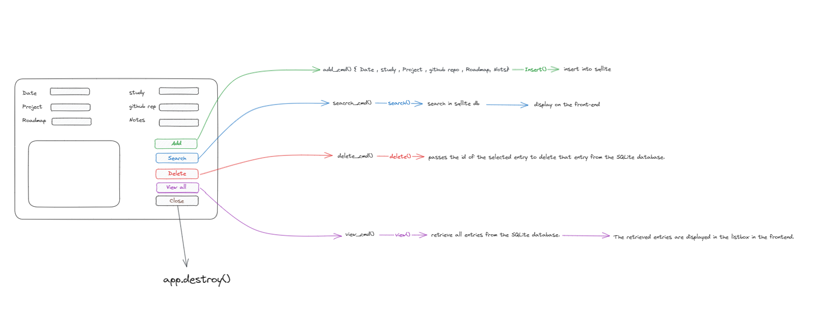

<p align="center">
  
</p>
### Activity Tracker Application

This application provides a simple graphical user interface (GUI) for tracking various activities and storing them in a SQLite database. It consists of two main components:

1. `frontend.py`: Contains the GUI using tkinter for user interaction.
2. `backend.py`: Handles interactions with the SQLite database.

### Prerequisites

Before running the application, ensure you have the necessary Python libraries installed:

- tkinter
- tkcalendar
- sqlite3

You can install the required libraries using pip: pip install tk tkcalendar


### Usage

1. Run the `backend.py` script to create the SQLite database and necessary table.

```	
$ python backend.py
```


2. Run the `frontend.py` script to launch the application's GUI.

```
$ python frontend.py
```

3. Interact with the GUI to add, view, search, or delete activity entries.

### Functionality

- **Add Entry**: Add a new activity entry with date, study, project, GitHub repositories, roadmap, and notes.
- **Search Entries**: Search for specific entries based on criteria like date, study, project, etc.
- **Delete Entry**: Delete a selected activity entry.
- **View All Entries**: Display all stored activity entries.

### Database Structure

The SQLite database consists of a table named "routine" with the following columns:
- `id`: Unique identifier (INTEGER, Primary Key)
- `date`: Date of the activity (TEXT)
- `study`: Study details (TEXT)
- `project`: Project details (TEXT)
- `github_repos`: GitHub repositories (TEXT)
- `roadmap`: Roadmap details (TEXT)
- `notes`: Additional notes (TEXT)

### Contributing

If you'd like to contribute to this project, feel free to submit a pull request.

### License

This project is licensed under the [MIT License](LICENSE).

### Author

Kernel-rb (Saif Matab)
